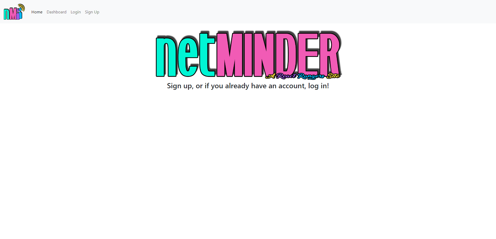

# NetMinder

## Description

We were tasked with creating a full stack MERN application using a React front end, GraphQL with a Node.JS and Express.JS server on the back end, MongoDB and Mongoose for the database, queries and mutations to retrieve, add, update, and delete data, and Heroku for deployment. We chose to create a networking reminder app that helps you schedule reminders to network with your peers and colleagues.

## Installation

On the front end, we used React, Apollo Client, Ant Design, and JSX. On the back end, Apollo Server, Bcrypt, Express.JS, MongoDB, Mongoose, GraphQL, and JSON Web Token.

## Usage

When you

## Credits

Collaborators are [Halima](https://github.com/Halimaxo), [Jessie](https://github.com/MrMessyFace), [Kar](https://github.com/karsodhi), [Rachel](https://github.com/rachelmcallister1), and [Ryan](https://github.com/rjpinks), with [Jen](https://github.com/Jdoyle5254) as our advisor.

https://github.com/React-Rangers/netminder-frontend
https://github.com/React-Rangers/netminder-backend

https://netminder-frontend-c2d1f8e64193.herokuapp.com/